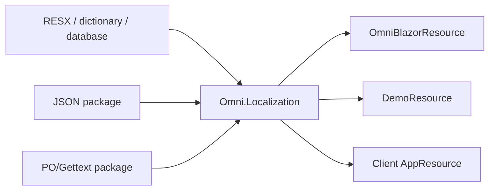

# Localization and globalization

Omni uses a framework-independent localization engine and keeps culture selection separate from
translation lookup:

- `AndersonN.Omni.Localization` works in any .NET application and has no Blazor dependency.
- `AndersonN.Omni.Blazor` owns the typed `OmniBlazorResource` and consumes that engine.
- `CultureInfo.CurrentUICulture` selects UI strings; `CurrentCulture` formats values.
- `OmniCultureScope` can override both cultures for one component subtree and emits `lang`/`dir`.

## Architecture



Every resource has an independent key space, default culture and reference catalog. Providers perform
exact-culture lookups only. The central resolver applies this deterministic order:

1. requested culture in provider priority order;
2. requested culture parents;
3. resource default culture and its parents;
4. stable key with `ResourceNotFound=true`.

Higher provider priority wins; equal priorities preserve DI registration order. Parent fallback is therefore
independent of provider registration order, so a neutral `fr` catalog can never mask a later exact `fr-CA` catalog.
Typed resource inheritance is opt-in with `AddOmniBaseResource<TResource, TBaseResource>()`; base resources
are consulted only after the derived resource's requested, parent and default chains miss. Registration rejects
direct and transitive cycles before the service provider is built.

## Use without Omni.Blazor

Install `AndersonN.Omni.Localization` and declare an empty marker type:

```csharp
using Omni.Localization;

public sealed class AppResource;

builder.Services.AddOmniLocalization();
builder.Services.AddOmniLocalizationResource<AppResource>(
    defaultCulture: "pt-BR",
    referenceCulture: "pt-BR",
    referenceTranslations: new Dictionary<string, string>
    {
        ["Home.Title"] = "Início",
        ["Cart.Items.One"] = "{0} item",
        ["Cart.Items.Other"] = "{0} itens"
    });
builder.Services.AddOmniTranslations<AppResource>("en", new Dictionary<string, string>
{
    ["Home.Title"] = "Home",
    ["Cart.Items.One"] = "{0} item",
    ["Cart.Items.Other"] = "{0} items"
});
```

Inject `IOmniLocalizer<AppResource>` in a service, component, endpoint, worker or MAUI view model.
Use `AddOmniStringLocalizerAdapter<AppResource>()` when existing code expects the standard
`IStringLocalizer<AppResource>` contract.

`OmniLocalizableText<TResource>` stores either a fixed value (`F:`) or late-bound key (`L:`), which is useful
for schemas, commands and persisted metadata that must be resolved only at render time.

## Omni.Blazor component translations

`AddOmniComponents()` registers `OmniBlazorResource`, the embedded pt-BR/English RESX catalogs and the
typed localizer. Application overrides remain concise:

```csharp
builder.Services.AddOmniTranslations("fr", new Dictionary<string, string>
{
    [OmniTranslationKeys.Close] = "Fermer",
    [OmniTranslationKeys.Save] = "Enregistrer"
});
builder.Services.AddOmniComponents();
```

This overload targets only `OmniBlazorResource`; it cannot collide with application-owned keys.

## Standard .NET RESX / `IStringLocalizer`

Use a host marker as a source for any target resource:

```csharp
builder.Services.AddLocalization(options => options.ResourcesPath = "Resources");
builder.Services.AddOmniStringLocalizer<AppResource, SharedResources>();
```

For component text, the convenience overload targets `OmniBlazorResource`:

```csharp
builder.Services.AddOmniStringLocalizer<SharedResources>();
builder.Services.AddOmniComponents();
```

The adapter scopes `CurrentUICulture` synchronously for an explicit lookup and restores it in `finally`.
It performs no asynchronous work on the render path and does not leak ambient culture between circuits.

## JSON catalogs

Install `AndersonN.Omni.Localization.Json`:

```json
{
  "culture": "en",
  "texts": {
    "Home": { "Title": "Home" },
    "Cart.Items.One": "{0} item",
    "Cart.Items.Other": "{0} items"
  }
}
```

```csharp
services.AddOmniJsonTranslations<AppResource>(utf8Json);
```

Nested objects and arrays flatten with `__`. Split catalogs are accepted in deterministic order; later
documents receive higher priority. Parsing happens at startup and publishes immutable frozen catalogs.
The adapter intentionally creates no watcher, background task or unbounded cache.

## PO / Gettext

Install `AndersonN.Omni.Localization.Po`:

```csharp
using Omni.Localization.Po;

services.AddOmniPortableObjectLocalization<AppResource>("Localization");
```

O provider PO do Orchard Core usa `IHostEnvironment` para localizar os arquivos. Em
ASP.NET Core e no .NET Generic Host isso já é registrado pelo host; para processos com
um `ServiceCollection` puro, prefira o provider JSON ou forneça explicitamente o
ambiente e o logging. O núcleo `Omni.Localization` não depende de hosting.

When the PO `msgctxt` marker differs from the target resource:

```csharp
services.AddOmniPortableObjectLocalization<OmniBlazorResource, SharedResources>();
services.AddOmniComponents();
```

Orchard owns PO discovery and cache eviction; the base localization package remains free of that dependency.

## Custom database and tenant providers

Implement `IOmniTranslationProvider<TResource>`. Providers must:

- return values only for `request.Culture` exactly;
- be thread-safe for their registered lifetime;
- return `false` on a miss;
- publish immutable snapshots atomically rather than mutate active dictionaries;
- perform external I/O before render-time lookup;
- expose precedence through `Priority`.

Register with `AddOmniTranslationProvider<TResource, TProvider>()`. Avoid network/database calls inside
`TryGetTranslation`; refresh asynchronously outside the render path and atomically swap a completed snapshot.

## Validation and diagnostics

Resolve `OmniTranslationCatalogValidator<TResource>` to check duplicate/unknown keys, empty values,
malformed composite formats, placeholder drift and optional completeness against that resource only.

```csharp
services.ConfigureOmniLocalization<AppResource>(options =>
{
    options.MissingTranslationBehavior = OmniMissingTranslationBehavior.Log;
    options.MaximumTrackedMissingTranslations = 256;
});
```

Diagnostics are resource-specific and bounded. `Throw` is appropriate for tests/staging; `Ignore` is the
allocation-free default. A parent-culture match is normal fallback. Reaching the resource default from an
unrelated requested culture is reported.

## Pseudolocalization

```csharp
services.AddOmniPseudoLocalization<AppResource>();
services.AddOmniPseudoLocalization(); // OmniBlazorResource convenience overload
```

`en-XA` expands the resource reference text and `ar-XB` exercises RTL/bidi. Placeholders remain intact.
The provider is stateless, cache-free and resource-scoped.

## Blazor Server and WebAssembly culture persistence

The host still owns supported cultures and persistence. Server apps should use `RequestLocalization` and a
culture cookie before mapping Razor components. WebAssembly apps should restore the selected culture before
`RunAsync` and include the required ICU data. Update the document root `lang` and `dir` when changing the global
culture so assistive technology and overlays observe the same metadata.

The showcase demonstrates this separation: `DemoResource` localizes the application shell/documentation while
`OmniBlazorResource` independently localizes the rendered controls.
