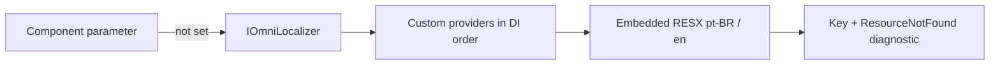

# Localization and globalization

Omni.Blazor separates UI translation from number/date formatting:

- `CultureInfo.CurrentUICulture` selects UI strings.
- `CultureInfo.CurrentCulture` formats dates, numbers and currencies.
- `OmniCultureScope` can override either culture for one component subtree and emits the matching `lang` and `dir` attributes.

The package includes complete `pt-BR` (neutral/default) and English catalogs. Every public base key is available through `OmniTranslationKeys.All`; `AllCatalogKeys` also includes plural variants and is the preferred translator/export surface.

## Architecture



The provider boundary is source-agnostic. A consumer can use an immutable dictionary/JSON snapshot, standard .NET `IStringLocalizer` and RESX, a database or tenant store, or an optional Gettext/PO implementation. Omni.Blazor does not require a PO runtime.

## Blazor Web App / Server

```csharp
using System.Globalization;
using Microsoft.AspNetCore.Localization;
using Omni.Blazor;

builder.Services.AddLocalization(options => options.ResourcesPath = "Resources");
builder.Services.AddOmniComponents();

var cultures = new[] { "pt-BR", "en-US", "fr-FR" }
    .Select(CultureInfo.GetCultureInfo)
    .ToArray();

app.UseRequestLocalization(new RequestLocalizationOptions
{
    DefaultRequestCulture = new RequestCulture("pt-BR"),
    SupportedCultures = cultures,
    SupportedUICultures = cultures
});
```

Set the culture cookie (or use a custom request-culture provider) before reloading the page. Call `UseRequestLocalization` before mapping Razor components.

## Blazor WebAssembly

Register localization, restore the user's selected culture before `RunAsync`, and include the required ICU data. Loading all data is convenient for a component showcase; a production app can ship a smaller ICU subset.

```xml
<PropertyGroup>
  <BlazorWebAssemblyLoadAllGlobalizationData>true</BlazorWebAssemblyLoadAllGlobalizationData>
</PropertyGroup>
```

```csharp
builder.Services.AddLocalization();
builder.Services.AddOmniComponents();

CultureInfo.DefaultThreadCurrentCulture = CultureInfo.GetCultureInfo(savedCulture);
CultureInfo.DefaultThreadCurrentUICulture = CultureInfo.GetCultureInfo(savedCulture);
```

## Add translations without rebuilding Omni.Blazor

For a dictionary, deserialized JSON file or immutable database snapshot:

```csharp
builder.Services.AddOmniTranslations("fr-FR", new Dictionary<string, string>
{
    [OmniTranslationKeys.Close] = "Fermer",
    [OmniTranslationKeys.Save] = "Enregistrer",
    ["DateRangeSummary.One"] = "{0} → {1} · {2} jour",
    ["DateRangeSummary.Other"] = "{0} → {1} · {2} jours"
});
builder.Services.AddOmniComponents();
```

`OmniTranslationCatalog` copies the input into a `FrozenDictionary`; mutate the source only by replacing the provider/scope, not concurrently.

For standard .NET localization, create a shared resource marker and register the adapter:

```csharp
builder.Services.AddLocalization(options => options.ResourcesPath = "Resources");
builder.Services.AddOmniStringLocalizer<SharedResources>();
builder.Services.AddOmniComponents();
```

The RESX entries use the stable names from `OmniTranslationKeys`. The Omni adapter scopes `CurrentUICulture` synchronously for each explicit lookup and restores it in a `finally` block. Therefore `IStringLocalizer` works inside `OmniCultureScope` even when the surrounding circuit uses another culture, without leaking ambient state.

For live database or tenant translations, implement `IOmniTranslationProvider`. Providers must be thread-safe for their registered lifetime, return `false` for a miss, and publish immutable snapshots rather than mutate dictionaries read by active renders.

## PO / Gettext

PO is a useful optional authoring format when translators use established Gettext tools. Install the separately versioned adapter; the core package remains free of the Orchard dependency:

```csharp
// dotnet add package AndersonN.Omni.Blazor.Localization.Po
using Omni.Blazor.Localization.Po;

builder.Services.AddOmniPortableObjectLocalization<SharedResources>("Localization");
builder.Services.AddOmniComponents();
```

Use stable keys such as `Close`, `DataImportReady.One` and `DataImportReady.Other` as `msgid`. Set `msgctxt` to the fully qualified resource marker type. The adapter registers Orchard's required memory-cache service and the standard `IStringLocalizer<T>` bridge; catalog discovery and eviction remain governed by Orchard Core.

## Validate and export catalogs

`OmniTranslationCatalogValidator.Validate` checks duplicate/unknown keys, empty values, malformed composite formats and placeholder drift before deployment. `OmniTranslationCatalog` refuses catalogs with validation errors; application-owned extension keys remain allowed with a warning.

Generate translator-ready JSON, blank RESX or POT templates directly from the authoritative embedded catalog:

```powershell
pwsh ./tools/export-localization-template.ps1 -Format json -Output translations/fr.json
pwsh ./tools/export-localization-template.ps1 -Format resx -Output Resources/SharedResources.fr.resx
pwsh ./tools/export-localization-template.ps1 -Format pot -ResourceContext MyApp.SharedResources -Output Localization/omni-blazor.pot
```

After editing `OmniTexts`, run `tools/generate-localization-resources.ps1`. CI regenerates the files and fails on drift, malformed formats, placeholder mismatches or obvious hard-coded Razor UI literals.

## Per-subtree culture and RTL

```razor
@using System.Globalization

<OmniCultureScope Culture="@ArabicCulture" UICulture="@ArabicCulture">
    <OmniDatePicker TValue="DateTime?" @bind-Value="date" />
</OmniCultureScope>

@code {
    private readonly CultureInfo ArabicCulture = CultureInfo.GetCultureInfo("ar-SA");
}
```

The scope infers `dir="rtl"` from `CultureInfo.TextInfo.IsRightToLeft`. The application still owns the document root: update `<html lang>` and `<html dir>` when changing the global culture so browser features, assistive technology and portals outside the scope receive the same metadata.

## Pluralization and diagnostics

Catalog plural keys use `.Zero`, `.One`, `.Two`, `.Few`, `.Many` and `.Other`. Omni includes rules for common one/other languages and Arabic, Slavic, Polish, Czech/Slovak and Slovenian forms. Register `IOmniPluralRule` for an application-specific rule.

Count-bearing built-ins use the plural pipeline rather than strings such as `item(s)`. An explicit component text parameter still wins and keeps its original composite-format contract.

Runtime diagnostics are opt-in and bounded per DI scope:

```csharp
builder.Services.AddOmniComponents(options =>
{
    options.Localization.MissingTranslationBehavior = OmniMissingTranslationBehavior.Log;
    options.Localization.MaximumTrackedMissingTranslations = 256;
});
```

Use `Throw` in localization tests or staging to reject a fallback immediately. The default `Ignore` preserves the zero-noise behavior and does not allocate tracking state on each lookup.

## Pseudolocalization

Register the stateless, cache-free provider in development and exercise `en-XA` (expanded LTR) plus `ar-XB` (RTL):

```csharp
builder.Services.AddOmniPseudoLocalization();
builder.Services.AddOmniComponents();
```

The transformation preserves composite placeholders byte-for-byte, requires no catalog/cache and is covered by browser overflow and document-direction tests. The localization showcase demonstrates scoped and global pseudo cultures in both Server and WebAssembly.

An explicit component text parameter always wins, then custom providers, then embedded resources. Unknown cultures fall back to the neutral `pt-BR` catalog so the UI never renders empty labels.
