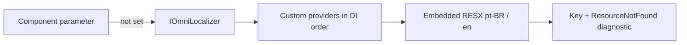

# Localization and globalization

Omni.Blazor separates UI translation from number/date formatting:

- `CultureInfo.CurrentUICulture` selects UI strings.
- `CultureInfo.CurrentCulture` formats dates, numbers and currencies.
- `OmniCultureScope` can override either culture for one component subtree and emits the matching `lang` and `dir` attributes.

The package includes complete `pt-BR` (neutral/default) and English catalogs. Every public key is available through `OmniTranslationKeys.All`.

## Architecture



The provider boundary is source-agnostic. A consumer can use an immutable dictionary/JSON snapshot, standard .NET `IStringLocalizer` and RESX, a database or tenant store, or an optional Gettext/PO implementation. Omni.Blazor does not require a PO runtime.

## Blazor Web App / Server

```csharp
using System.Globalization;
using Microsoft.AspNetCore.Localization;
using Omni.Blazor;

builder.Services.AddLocalization(options => options.ResourcesPath = "Resources");
builder.Services.AddOmniComponents();

var cultures = new[] { "pt-BR", "en-US", "fr-FR" }
    .Select(CultureInfo.GetCultureInfo)
    .ToArray();

app.UseRequestLocalization(new RequestLocalizationOptions
{
    DefaultRequestCulture = new RequestCulture("pt-BR"),
    SupportedCultures = cultures,
    SupportedUICultures = cultures
});
```

Set the culture cookie (or use a custom request-culture provider) before reloading the page. Call `UseRequestLocalization` before mapping Razor components.

## Blazor WebAssembly

Register localization, restore the user's selected culture before `RunAsync`, and include the required ICU data. Loading all data is convenient for a component showcase; a production app can ship a smaller ICU subset.

```xml
<PropertyGroup>
  <BlazorWebAssemblyLoadAllGlobalizationData>true</BlazorWebAssemblyLoadAllGlobalizationData>
</PropertyGroup>
```

```csharp
builder.Services.AddLocalization();
builder.Services.AddOmniComponents();

CultureInfo.DefaultThreadCurrentCulture = CultureInfo.GetCultureInfo(savedCulture);
CultureInfo.DefaultThreadCurrentUICulture = CultureInfo.GetCultureInfo(savedCulture);
```

## Add translations without rebuilding Omni.Blazor

For a dictionary, deserialized JSON file or immutable database snapshot:

```csharp
builder.Services.AddOmniTranslations("fr-FR", new Dictionary<string, string>
{
    [OmniTranslationKeys.Close] = "Fermer",
    [OmniTranslationKeys.Save] = "Enregistrer",
    ["DateRangeSummary.One"] = "{0} → {1} · {2} jour",
    ["DateRangeSummary.Other"] = "{0} → {1} · {2} jours"
});
builder.Services.AddOmniComponents();
```

`OmniTranslationCatalog` copies the input into a `FrozenDictionary`; mutate the source only by replacing the provider/scope, not concurrently.

For standard .NET localization, create a shared resource marker and register the adapter:

```csharp
builder.Services.AddLocalization(options => options.ResourcesPath = "Resources");
builder.Services.AddOmniStringLocalizer<SharedResources>();
builder.Services.AddOmniComponents();
```

The RESX entries use the stable names from `OmniTranslationKeys`. `IStringLocalizer` follows the ambient `CurrentUICulture`, as specified by .NET.

For live database or tenant translations, implement `IOmniTranslationProvider`. Providers must be thread-safe for their registered lifetime, return `false` for a miss, and publish immutable snapshots rather than mutate dictionaries read by active renders.

## PO / Gettext

PO is a useful optional authoring format when translators need context, plural forms and established translation tools. In ASP.NET Core it requires a third-party provider such as `OrchardCore.Localization`; Microsoft does not provide support for that package. Once it supplies `IStringLocalizer<T>`, the same adapter works:

```csharp
builder.Services.AddPortableObjectLocalization(options => options.ResourcesPath = "Localization");
builder.Services.AddOmniStringLocalizer<SharedResources>();
builder.Services.AddOmniComponents();
```

Keeping PO outside the Omni.Blazor core avoids forcing an extra runtime, parser and update policy on every application. Teams that prefer JSON, RESX or a translation database retain the same component API.

## Per-subtree culture and RTL

```razor
@using System.Globalization

<OmniCultureScope Culture="@ArabicCulture" UICulture="@ArabicCulture">
    <OmniDatePicker TValue="DateTime?" @bind-Value="date" />
</OmniCultureScope>

@code {
    private readonly CultureInfo ArabicCulture = CultureInfo.GetCultureInfo("ar-SA");
}
```

The scope infers `dir="rtl"` from `CultureInfo.TextInfo.IsRightToLeft`. The application still owns the document root: update `<html lang>` and `<html dir>` when changing the global culture so browser features, assistive technology and portals outside the scope receive the same metadata.

## Pluralization and diagnostics

Catalog plural keys use `.Zero`, `.One`, `.Two`, `.Few`, `.Many` and `.Other`. Omni includes rules for common one/other languages and Arabic, Slavic, Polish, Czech/Slovak and Slovenian forms. Register `IOmniPluralRule` for an application-specific rule.

```csharp
OmniLocalizedString result = localizer.Localize(key, culture);
if (result.ResourceNotFound)
    logger.LogWarning("Missing Omni translation {Key} for {Culture}", key, culture.Name);
```

An explicit component text parameter always wins, then custom providers, then embedded resources. Unknown cultures fall back to the neutral `pt-BR` catalog so the UI never renders empty labels.
